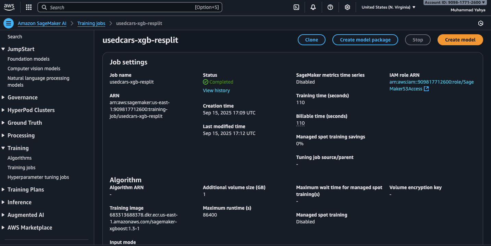
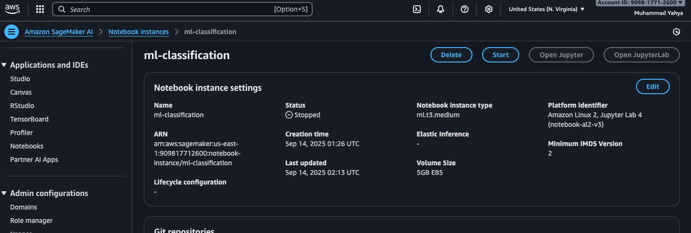
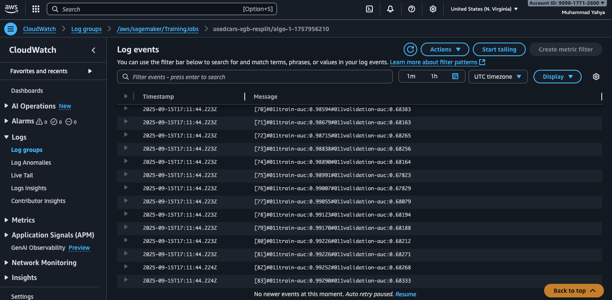

# Used Cars Accident Prediction — End-to-End ML Pipeline

## Overview

This repository contains all artifacts, scripts, processed data, and screenshots for an end-to-end machine learning project.
The goal of this project was to predict whether a used car listing has been in an accident based on its attributes.

The pipeline involved:

- Exploratory Data Analysis (EDA) to understand and clean the dataset

- Feature engineering (handling missing data, one-hot encoding, frequency encoding, rare category grouping, etc.)

- Model training using XGBoost on AWS SageMaker

- Model evaluation with precision, recall, F1-score, and AUC metrics

- Monitoring & logs with CloudWatch

## Repo Layout

| Folder / File                                   | Purpose                                                                  |
| ----------------------------------------------- | ------------------------------------------------------------------------ |
| `eda.ipynb`                                     | Jupyter notebook for data exploration, cleaning, and feature engineering |
| `sageMaker-notebook-instance.ipynb`             | Notebook run in AWS SageMaker for model training and evaluation          |
| `used_cars.csv`                                 | Raw dataset used for training (uploaded to S3 in workflow)               |
| `processed_csvs/`                               | Train/validation/test CSVs used by SageMaker for XGBoost training        |
| `processed_csvs/usedcars_xgb_train_resplit.csv` | Training dataset (features + labels)                                     |
| `processed_csvs/usedcars_xgb_val_resplit.csv`   | Validation dataset                                                       |
| `processed_csvs/usedcars_xgb_test_resplit.csv`  | Test dataset (for final evaluation)                                      |
| `processed_csvs/usedcars_xgb_test_features.csv` | Test features without labels                                             |
| `screenshots/`                                  | Screenshots of SageMaker training jobs, CloudWatch logs, and results     |
| `README.md`                                     | Main project documentation                                               |

## Project Workflow

1. Data Exploration (EDA)

    - Loaded used_cars.csv into Pandas for exploration.

    - Analyzed missing data, correlations, and label distribution.

    - Created missingness flags (*_missing) to capture whether a value was missing.

    - Applied feature engineering:

        - Filled categorical missing values with "Unknown"

        - Filled numeric missing values with median

        - One-hot encoded low-cardinality categorical features

        - Frequency-encoded high-cardinality categorical features (brand, model, ext_col, etc.)

        - Grouped rare categories under "Other"

2. Data Preparation for SageMaker

    - Split data into train (70%), validation (15%), and test (15%) with train_test_split.

    - Saved into CSVs (processed_csvs/) for SageMaker training input.

3. Model Training (SageMaker)

    - Used XGBoost algorithm provided by SageMaker.

    - Configured hyperparameters (learning rate, depth, eval metric).

    - Submitted training job with input from processed_csvs/.

     
    
    

4. Monitoring with CloudWatch

    - Training job logs were streamed to CloudWatch for monitoring.

    - Checked metrics like iterations, training/validation error, and job completion.

    

5. Model Evaluation

    - Evaluated trained model on test set (usedcars_xgb_test_resplit.csv).

    - Metrics:

    ``` 
        Test AUC: 0.7014  
        Precision: 0.35  
        Recall: 0.80  
        F1-score: 0.49  
        Accuracy: 0.57
    ```

    **Confusion Matrix:**

    |                     | Predicted Negative  | Predicted Positive   |
    | ------------------- | ------------------- | -------------------- |
    | **Actual Negative** | True Negative = 216 | False Positive = 221 |
    | **Actual Positive** | False Negative = 29 | True Positive = 119  |

## Conclusion

I successfully built and deployed an end-to-end ML pipeline on AWS SageMaker for predicting car accidents from used car data.
The model achieved good recall (0.80), meaning it is effective at identifying accident cars, though precision was lower (0.35).
This trade-off is useful in real-world scenarios where missing an accident car is more costly than flagging extra ones.
